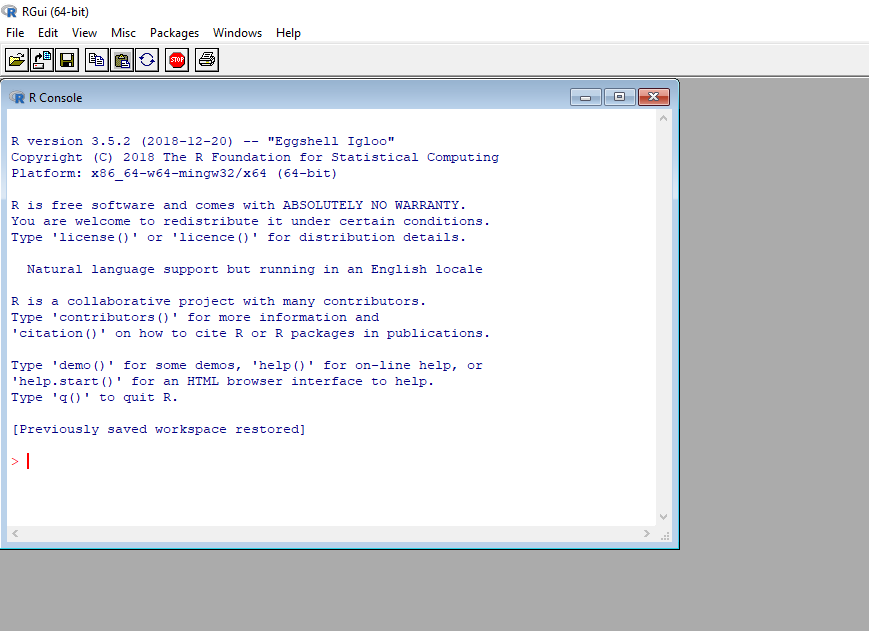
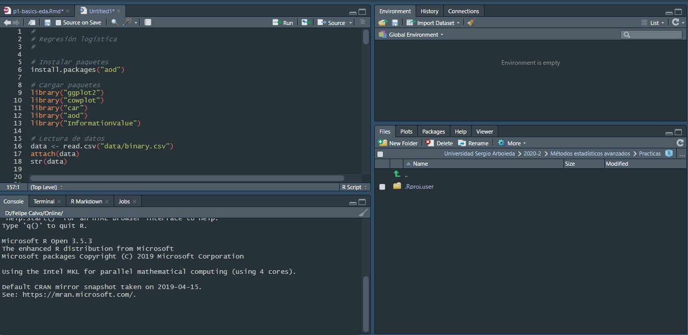

```{r setup, include=FALSE}
knitr::opts_chunk$set(echo = TRUE)
```

## ¿Qué es R?

* R es un lenguaje de programación de acceso libre, inicialmente diseñado y utilizado para realizar análisis estadístico
* R es el programa que instalamos para interpretar el código que escribimos
* RStudio es un IDE (Integrated Development Environment) que funciona como una "máscara" sobre R, con más herramientas y facilidades

## ¿Por qué nos gusta?

* Es una forma BBB de convertirse en un geek
* No solamente permite realizar análisis estadístico; tambien es posible capturar información de páginas web, crear aplicaciones web, procesar texto, entre otras cosas
* La comunidad que lo usa es muy amplia (= muchísima ayuda e información en internet)
* Es muy versátil para la creación de gráficos
* Tiene disponibles muchos paquetes para diferentes tipos de análisis
* ¡ES GRATIS!

## Particularmente útil para

1. Manejar, combinar, limpiar y reorganizar datos
2. Análisis estadístico, álgebra matricial, modelado, estadística avanzada
3. Entorno gráfico poderoso para explorar datos o para publicar
4. Análisis **pipeline**: entrada -> algoritmo de procesamiento -> salida

## ¿Por qué no usar R?

* R no puede hacer todo
* La documentación a veces es muy técnica o muy compacta
* No todo el código ha sido exhaustivamente testeado, es decir, no siempre hay garantías que las cosas funcionen
* La curva de aprendizaje es más difícil que programas como SPSS o Minitab

## ¿Cómo correr comandos/código?

* Si se está trabajando en el panel **console** solamente es necesario presionar “Enter”.
* Si se está trabajando en un **script** es posible ejecutar los comandos presionando "Ctrl+Enter"
* Adicionalmente, el símbolo “#” nos permite incluir comentarios en cualquier lugar del **script**
* ¡Siempre usen **scripts** (si nunca antes has creado un *'programa para un computador'* en este curso lo vas a hacer)!

## Instalación de R

[https://cran.r-project.org/](https://cran.r-project.org/) 



## Interfaces de usuario

* Por defecto
* [RStudio](http://www.rstudio.org/): funciona en Windows, MacOS, Linux. Recomendada
* [Eclipse](http://www.eclipse.org/eclipse): funciona en Windows, MacOS, Linux.
* Entre otras

 

## Front-ends gráficos

* [Rcmdr](https://socialsciences.mcmaster.ca/jfox/Misc/Rcmdr/)
* [RKWard](https://rkward.kde.org/)

## Grupos de funciones (Paquetes)

* Cuando varias funciones son desarrolladas con un objetivos similar se suelen agrupar en paquetes, los cuales son colaborativamente distribuidos y de forma gratuita
* Para utilizar de las funciones de un paquete es necesario instalar este paquete primero usando **install.packages()** y luego cargarlo en nuestro ambiente de trabajo usando **library()**
* Se instalan una vez y se llaman muchas veces
* [Lista de paquetes del CRAN](https://cran.r-project.org/web/packages/available_packages_by_date.html)
* [Lista de paquetes de Bioconductor](https://www.bioconductor.org/packages/release/bioc/)
* [rdrr.io](https://rdrr.io/)

## Buena práctica: usar los proyectos de RStudio

* **projects** es la manera integral de ajustar el ambiente de trabajo para un proyecto
* Por reproducibilidad, facilidad y para tener los proyectos mejor organizados es mucho mejor usar **projects**

## Creación de nuestro primer proyecto

1. Abrir RStudio
2. Clic en **File > New Project**
    + **New Directory > New Project** si queremos crear una nueva carpeta en nuestro equipo
    + **Existing Directory** si queremos alojar nuestro proyecto en una carpeta ya creada
3. Una vez creado el proyecto, podemos verificar que la ventana del programa se renombra y apunta a la carpeta donde está alojado.
4. Clic en **File > New File > R Script**. En la ventana que se carga ya podemos empezar a ejecutar nuestro código.

&nbsp;