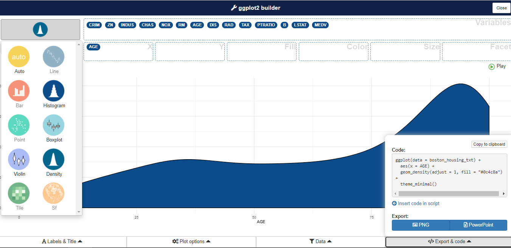

```{r setup, include=FALSE}
knitr::opts_chunk$set(echo = TRUE)
```

## Importar datos

```{r, eval=FALSE}
library("tidyverse")

## Lectura
read_delim(
  file = "data/Boston_Housing.txt",
  delim = "|", 
  locale=locale(decimal_mark = ",")
) -> boston_housing_txt

## Revisar la estructura de los datos
str(boston_housing_txt)

## Le decimos a R que vamos a trabajar con esos datos y se los ponemos "en primer plano"
attach(boston_housing_txt)
```

```{r, echo=F, results='hide', message=F, warning=F}
library("tidyverse")

## Lectura
read_delim(
  file = "data/Boston_Housing.txt",
  delim = "|", 
  locale=locale(decimal_mark = ",")
) -> boston_housing_txt

## Revisar la estructura de los datos
str(boston_housing_txt)

## Le decimos a R que vamos a trabajar con esos datos y se los ponemos "en primer plano"
attach(boston_housing_txt)
```

## Estadísticos descriptivos frecuentes

```{r, eval=FALSE}
mean # para la media
median #para la mediana
var # para la varianza
sd # para la desviación estándar
max # para el máximo
min # para el mínimo
cov # para la covarianza
cor # para la correlación
```

### Ejemplo: estadísticos descriptivos para la variable AGE

```{r}
mean(AGE)
median(AGE)
var(AGE)
sd(AGE)
max(AGE)
min(AGE)
```

## Un método útil: summary()

```{r}
## Resumen para una sola variable
summary(AGE)
## Resumen para todo el conjunto de datos
summary(boston_housing_txt)
```

Normalmente estas funciones no trabajan si encuentran datos perdidos, para eliminar esta restricción se usa

```{r, eval=FALSE}
na.rm = TRUE

## Cálculo del promedio omitiendo datos perdidos/faltantes
mean(AGE, na.rm = TRUE)
```

## Gráficas básicas

### Diagrama de puntos

Presenta los valores de una variable para cada observación usando símbolos, y cada observación se grafica de manera relativa al número de la observación.

```{r}
plot(AGE)
```

### Histogramas

Es un tipo de gráfica de barras que muestra conteos o frecuencias relativas de valores que caen en diferentes intervalos.

```{r}
hist(AGE)
```

Podemos cambiar el número de barras usando el parámetro **breaks**

```{r}
hist(AGE, breaks=20)
```

### Gráficos de densidad (también llamados gráficas Kernel o histogramas suavizados)

Muestra las frecuencias relativas locales de los puntos a lo largo del eje X. En otras palabras, en los intervalos donde hay más puntos/observaciones la gráfica crece indicando mayor "densidad".

```{r}
plot(density(AGE))
```

### Boxplot

Muestra la ubicación, dispersión y distribución de una variable mediante la construcción de una figura en forma de caja con un conjunto de líneas (bigotes) que se extienden desde los extremos de la caja. Los bordes del cuadro se dibujan en los percentiles 25 y 75 de los datos, y una línea en el medio del cuadro marca el percentil 50.

```{r}
boxplot(AGE)
```

> **Nota**: en este ejemplo todas las variables de la base de datos son cuantitativas (en adelante nos referiremos a ellas como **variables contínuas**), y en estos casos los tipos de gráficos que más se usan son los histogramas y los boxplots. Si tuviésemos variables cualitativas (en adelante nos referiremos a ellas como **variables categóricas**), estas usualmente se representan mediante diagramas de barras o diagramas de torta. 

## Una librería útil con una interfaz para hacer gráficas: *esquisse*

```{r, eval=FALSE}
## Instalamos la librería
install.packages("esquisse")

## Cargamos la librería
library("esquisse")

## Llamamos a la función esquisser especificando con cuales datos queremos trabajar
esquisser(data = boston_housing_txt, viewer = "browser")
```



## Gráficos profesionales

* [Galería de gráficas en R](https://www.r-graph-gallery.com/)
* [Top 50 de visualizaciones en R](http://r-statistics.co/Top50-Ggplot2-Visualizations-MasterList-R-Code.html)


&nbsp;